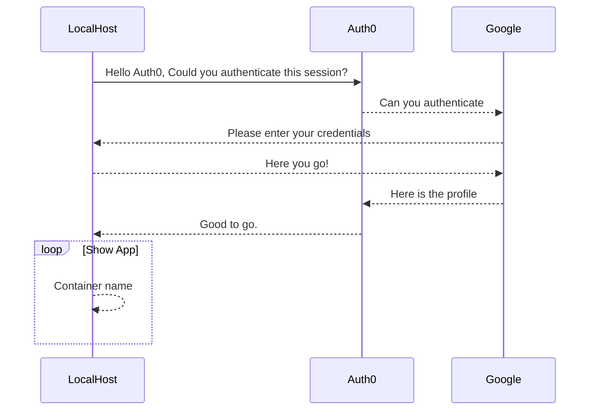

## Deploying Ambassador on local machine (docker)

We assume that you had docker installed and have **Kubernetes** running on it.

## Run and learn

### Create Ambassador + Ambassador (PRO) containers

*NOTE: Ambassador PRO needs Ambassador running so follow the order of execution.*

#### Step 1 : Datawire.IO - Ambassador API gateway

```
# Assumption - Ambassador running with RBAC enabled.
kubectl apply -f ambassador-rbac.yaml
```

#### Step 2 : Datawire.IO - Get License key and replace the <>

Apply for one here: https://www.getambassador.io/pro/free-trial/
```
kubectl create secret docker-registry ambassador-pro-registry-credentials --docker-server=quay.io --docker-username=<CREDENTIALS USERNAME> --docker-password=<CREDENTIALS PASSWORD> --docker-email=<YOUR EMAIL>
```

#### Step 3 : Datawire.IO - Ambassador PRO (Add On)

*EDIT* and replace Machine to Machine Auth0 keys `<>` in `ambassador-pro-auth.yaml`

*NOTE:  Auth0 callback URL should be http://localhost/callback*
```
# Assumption - Ambassador is running with RBAC enabled.
kubectl apply -f ambassador-pro-auth.yaml
```

#### Step 4 : Deploy

```
# Assumption - Ambassador is running with RBAC enabled.
kubectl apply -f my_container_name.yaml
```

then,

```
open http://localhost/containername
```


## Ambassador <> Auth0 flow



